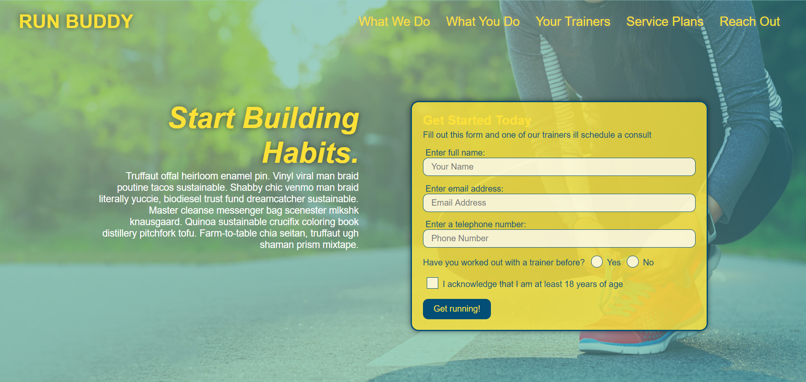
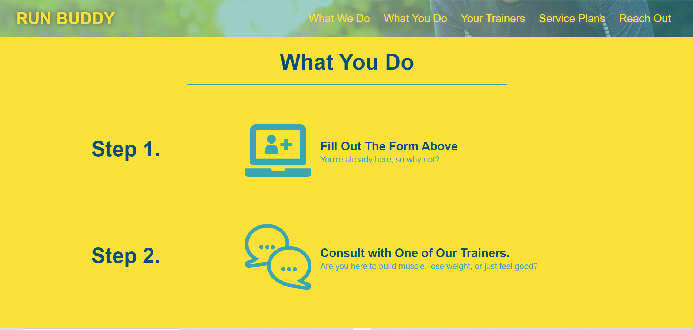
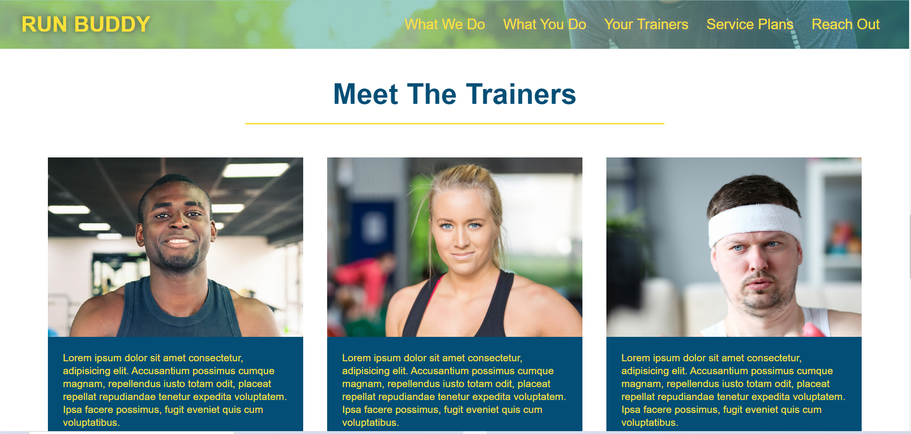
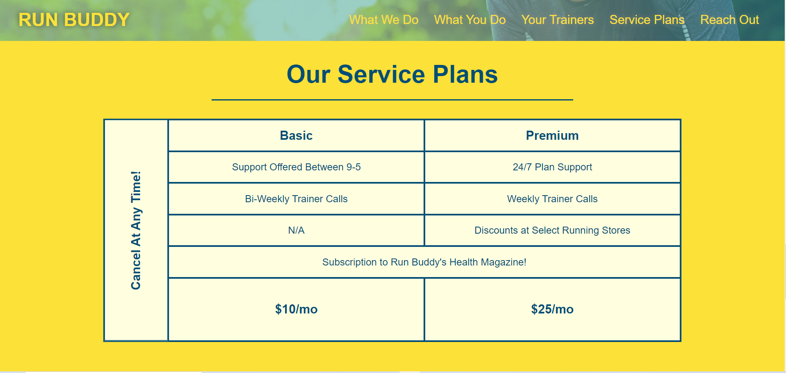
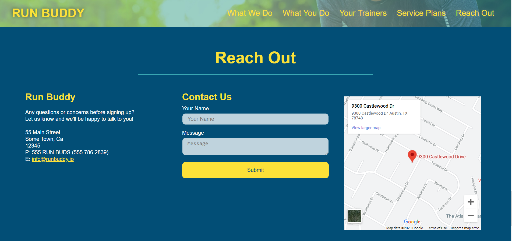

# Run Buddy

## Description
A single-page brochure website offering fitness services.  Features sections to describe company mission, highlight steps to receive services, introduce the team, and contact the business.

##### Homescreen

##### What You Do View

##### Meet The Trainers View

##### Service Plans View

##### Reach Out View

Visit site [here](https://christopherconcannon.github.io/run-buddy/)

## Table of Contents
  * [Installation](#installation)
  * [Usage](#usage)
  * [License](#license)
  * [Technologies](#technologies)
  * [Contributing](#contributing)
  * [Testing](#testing)
  * [Questions](#questions)
  
## Installation
Clone project to a directory on your local machine and cd into run-buddy directory. 

## Usage
Open index.html file in browser of your choice to navigate through the site.

## License 
This project is covered under the MIT license 

## Technologies 
HTML5, CSS3

## Contributing
To see the guidelines adopted for contributing to this project, please view the [Contributor Covenant](https://www.contributor-covenant.org/version/2/0/code_of_conduct/code_of_conduct.txt)

## Testing
Tests coming soon

## Questions
Visit me at GitHub  
[christopherConcannon](https://github.com/christopherConcannon)
  
If you have any questions or would like to contact me, please email me at  
[cmcon@yahoo.com](mailto:cmcon@yahoo.com)

